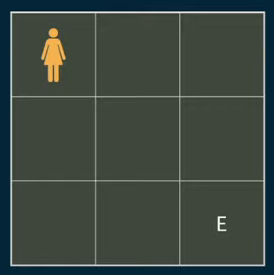
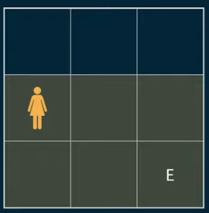
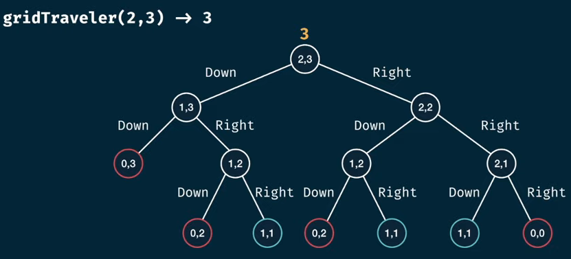

# gridTraveler Memorization

## Problem Statement

Say that you are a traveler on a 2D grid. You begin in the top-left corner and your goal is to travel to the bottom-right corner. You may only move down or right.

In how many ways can you travel to the goal on a grid with dimensions m * n?

Write a function `gridTraveler(m, n)` that calculates this.

## Lets understand the problem

Lets say they asked us to calculate `gridTraveler(2, 3)`. They are asking us how many ways can you travel from the top left to the bottom right in a 2 * 3 grid. 2 rows and 3 columns.

```js
gridTraveler(2,3) -> 3

1. right, right, down
2. right, down, right
3. down, right, right
```

How about 1 * 1 grid?
```js
gridTraveler(1,3) -> 1

start is the same as the end
1. "do nothing"
```

How about (0, 1), (1, 0), (0, 0)
```js
gridTraveler(0,1) -> 0
"because such a grid can't exist"
```

### Let's look at a (3, 3) grid
```js
gridTraveler(3,3) -> ?
```


Let's move down, one step. According to the rules I can onlt move right or down. So my movable area becomes a (2, 3) gird, as seen below



So we've just shrinked the problem. So it's a dunamic programming problem.

Okay, so now we understand the problem and have found some features - each move shrinks the area and creates a sub problem.

### A tree base viz of the problem

The above grid based viz is helpful. But let's also have a tree based viz.


Here you learned the problem's solution is just a diff way of our original fib problem. Most of dynamic programming problems can be solved using this.

## Bruteforce solution

```js
const gridTraveler = (m, n) => {
    if(m === 1 && n === 1) return 1;
    if(m === 0 || n === 0) return 0;
    // branching for one step right and one step down
    return gridTraveler(m - 1, n) + gridTraveler(m, n- 1 );
};
```

But if we try this with a larger value the program will take a verylong time. So it's time to optimize our solution. But first let's find the complexity of this so that we can know how to and what to improve it.

### Lets take gridTraveler(2, 3) and find it's complexity

The time complexity depends how many node we have for our fn recursive call. But to determine to number of node, it depends on both `m` (rows) and `n` (columns). 

Remember we had a time complexity of `O(2^n)` for a branching fn (fib) previously? Here it does have the same pattern which is `O(2^x)` but since it depends on two variables m and n instead of just n (in fib) here we can just substiture x to be m + n. So our time complexity is `O(2^(m + n))`.

Likewise space complexity is hight of the tree. The height of the tree gives us the max stack memory in a recursion. So it's `O(n + m)`.

### Improvements in complexity

There are many sub trees. Also the number of ways to solve a (1, 2) grid is the same for the number of ways to solve a (2, 1) grid. So they are a single sub problem.

```js
gridTraveler(a, b) = gridTraveler(b, a)
```

So the solution is to `MEMOIZE IT`.

## Solution - Memoized

```js
const gridTraveler = (m, n, memo = {}) => {
    const key = m + "," + n;
    // are the args in the memo
    if(key in memo) return memo[key];

    if(m === 1 && n === 1) return 1;
    if(m === 0 || n === 0) return 0;
    // branching for one step right and one step down
    memo[key] = gridTraveler(m - 1, n, memo) + gridTraveler(m, n- 1, memo);
    return memo[key];
};
```

With this our time complexity is `O(m * n)` and the space complexity is `O(m + n)`

