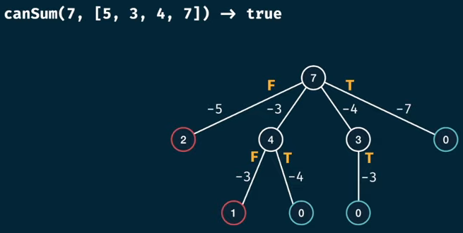
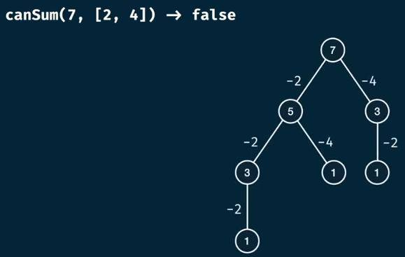
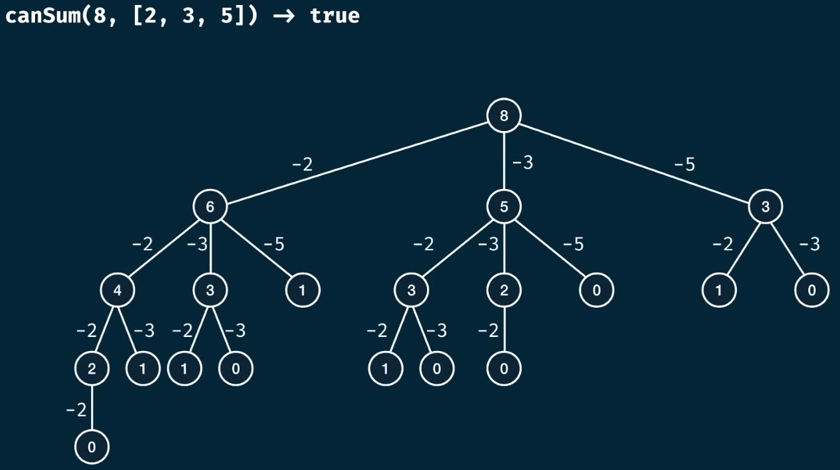

# canSum memoization

## Problem Statement

Write a function `canSum(targetSum, numbers)` that takes in a targetSum and an array of numbers as arguments.

The function should return a boolean indicating whether or not it is possible to generate the targetSum using number from the array.

You may use an element of the array as many times as needed.

You may assume that all input numbers are non negative.

## Lets understand the problem

Lets say they asked us to calculate `canSum(7, [5, 3, 4, 7])`, here the response is `true`. Another example `canSum(7, [2, 4])`, here the response is `false`.

### Tree for canSum(7, [5, 3, 4, 7])



Once we draw the tree of the problem we are able to uunderstand how out program logic must me.

If we can reach a zero then thats a possible solution

### Tree for canSum(7, [2, 4])



## Bruteforce solution

Let's viz `canSum(8, [2, 3, 5]) -> true`



### Complexity

```
m = target sum
n = array length
```

Let's fist analize the height of the tree. For the current problem